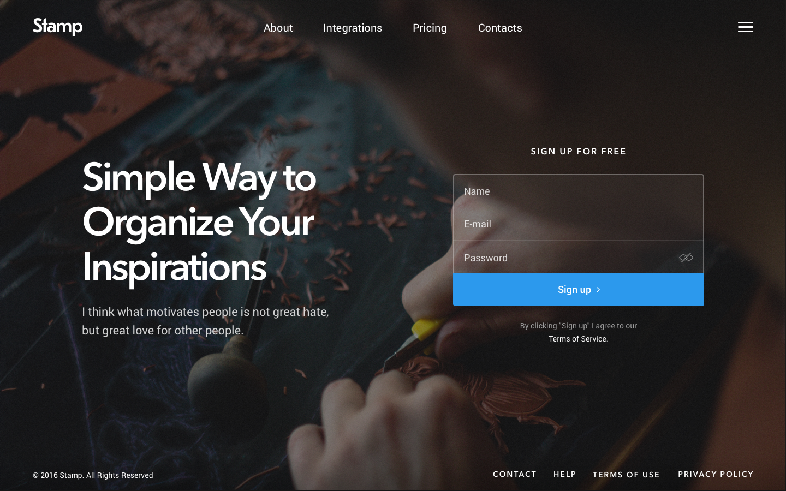

# Front End Developer Challenge

## Welcome! 👋

Thanks for taking the time to check out this code challenge.

**To complete this challenge, you need a basic understanding of HTML, CSS, and JavaScript.**

## The Challenge

Your goal is to create a landing page that looks as close as possible to the designs included in the design folder.

**Please do not use any third-party libraries, frameworks, or components for this challenge. All markup and code should be written from scratch in plain HTML, CSS, and JavaScript.**

### General Notes

- Links don't need to point anywhere (`#` works fine)
- The form doesn't need to lead anywhere but it does need to be styled
- Menu(s) should be implemented but it's up to you how you'd like them to function
- The mobile layout is only available in `.png` format - it is not included in the Sketch or Figma files
- If you're unsure about something, please use your best judgment to determine a solution

### High Priority Items

Below are things you should pay particular attention to when completing this challenge.

- Responsive design and development
- Page performance (e.g. loading speed)
- Interactive element states (e.g. hover, focus, etc.)

### Low Priority Items

Below are things you should not worry about when completing this challenge.

- Exactly matching the fonts and icons
- Exactly matching the text content from the design (placeholder text is fine)

## Getting Started

1. Set up this project with version control (e.g. Git)
2. Read this `README.md` file and familiarize yourself with the project structure
3. Start coding!

**Have fun building!** 🚀

